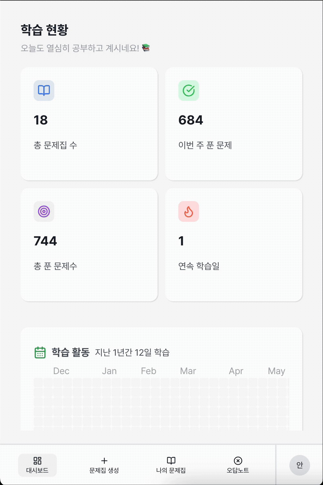
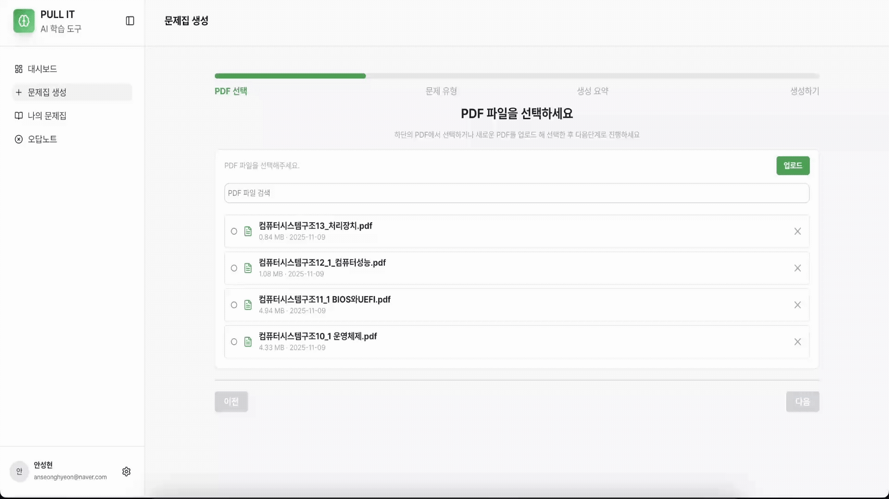
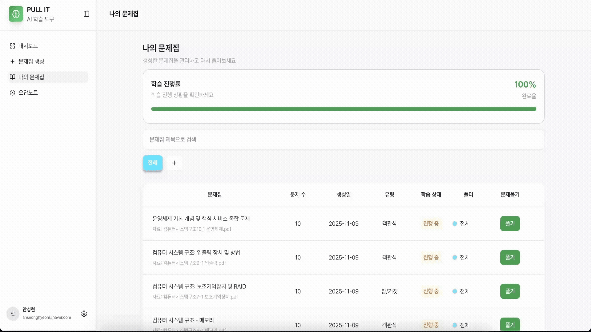
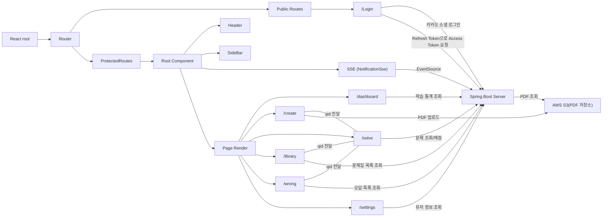

# 풀잇 FrontEnd


<div align="center">

## 🎓 AI 기반 스마트 학습 플랫폼, Pull It

### [ 🏆 최우수상 ]

> **PDF만 업로드하면 AI가 자동으로 문제를 생성하고, 오답노트까지 관리해주는 통합 학습 플랫폼**

---

### 💡 왜 Pull It인가?

|       핵심 가치        | 설명                                                                             |
| :--------------------: | -------------------------------------------------------------------------------- |
|    **능동적 학습**     | 책을 읽기만 하는 수동적 학습이 아닌, 문제 풀이를 통한 정보 인출로 장기 기억 형성 |
|       **자동화**       | 문제 제작의 피로감 없이 학습에만 집중                                            |
| **지속 가능한 시스템** | 학습 기록 관리 + 오답 복습 + 학습 동기부여까지 제공하는 학습 생태계              |

---

**개발기간**: 2025년 9월 ~ 2025년 11월 (3개월)

</div>

---

## 목차

<table>
<tr>
<td width="50%">

### 📋 프로젝트 정보

- **[주요 기능](#주요-기능)** - 5가지 핵심 기능 소개
- **[아키텍처](#아키텍처)** - 시스템 구조 및 설계
- **[기술 스택](#기술-스택)** - 사용된 기술 및 도구
- **[디렉터리 구조](#디렉터리-구조)** - 프로젝트 파일 구성

</td>
<td width="50%">

### 🤝 협업 가이드

- **[Git 규칙](#git-규칙)** - Commit, Branch, PR 가이드
- **[코드 컨벤션](#코드-컨벤션)** - Airbnb 스타일 가이드
- **[팀원](#팀원)** - 프론트엔드 개발팀

</td>
</tr>
</table>

---

<!-- 주요 기능 -->

## 주요 기능

### 1. 대시보드 - 학습 현황 한눈에

> **종합 학습 통계**  
> 총 문제집 수, 이번 주 푼 문제, 총 푼 문제 수, 연속 학습일 제공

> **잔디 그래프**  
> 최근 1년간의 학습 현황을 시각화하여 학습 동기 부여

<table>
<tr>
<td width="50%" align="center"><b>🖥️ PC 뷰</b></td>
<td width="50%" align="center"><b>📱 모바일 뷰</b></td>
</tr>
<tr>
<td width="50%"></td>
<td width="50%"></td>
</tr>
</table>

<br/>

### 2. 문제집 생성 - AI 자동 생성

> **PDF 업로드 및 관리**  
> 학습 자료를 업로드하고 체계적으로 관리

> **다양한 문제 유형**  
> 객관식, 참/거짓, 단답형 문제 자동 생성

> **실시간 알림(SSE)**  
> 문제 생성 중에도 다른 페이지 이용 가능, 완료 시 알림 제공

<table>
<tr>
<td width="50%" align="center"><b>🖥️ PC 뷰</b></td>
<td width="50%" align="center"><b>📱 모바일 뷰</b></td>
</tr>
<tr>
<td width="50%"></td>
<td width="50%"></td>
</tr>
</table>

<br/>

### 3. 문제 풀이 - 실시간 채점 시스템

> **유형별 맞춤 인터페이스**  
> 문제 유형에 최적화된 풀이 환경 제공

> **자동 채점**  
> 모든 문제 풀이 완료 시 즉시 정답/오답 확인

> **정답 및 해설 제공**  
> 학습 능률 향상을 위한 상세 해설

> **반복 학습**  
> 생성된 문제집에 언제든 여러 번 접근 가능

<table>
<tr>
<td width="50%" align="center"><b>🖥️ PC 뷰</b></td>
<td width="50%" align="center"><b>📱 모바일 뷰</b></td>
</tr>
<tr>
<td width="50%"></td>
<td width="50%"></td>
</tr>
</table>

<br/>

### 4. 나의 문제집 - 체계적 관리

> **폴더 구조**  
> 폴더 생성/삭제를 통한 문제집 분류 및 관리

> **문제집 관리**  
> 이름 변경, 복습, 삭제 등 체계적인 관리 기능

> **전체 문제 제공**  
> 풀기 버튼으로 전체 문제 테스트 진행

<table>
<tr>
<td width="50%" align="center"><b>🖥️ PC 뷰</b></td>
<td width="50%" align="center"><b>📱 모바일 뷰</b></td>
</tr>
<tr>
<td width="50%"></td>
<td width="50%"></td>
</tr>
</table>

<br/>

### 5. 오답노트 - 효율적 복습

> **틀린 문제만 집중**  
> 오답에 대해서만 선택적 복습 가능

> **폴더 연동**  
> 나의 문제집 폴더와 동기화되어 체계적 관리

> **진도 관리**  
> 오답을 맞힐 때마다 오답 수 감소, 모두 맞추면 자동 삭제

> **효과적인 학습**  
> 약점만 집중 공략하여 학습 효율 극대화

<table>
<tr>
<td width="50%" align="center"><b>🖥️ PC 뷰</b></td>
<td width="50%" align="center"><b>📱 모바일 뷰</b></td>
</tr>
<tr>
<td width="50%"></td>
<td width="50%"></td>
</tr>
</table>

<!-- 주요 기능 -->

---

## 아키텍처

### 시스템 구조



### 페이지별 주요 기능

> **AppLayout (전역)**  
> SSE 연결 유지, 문제 생성 완료 시 실시간 알림 수신

> **Create (문제집 생성)**  
> PDF 파일을 S3에 업로드 → S3 URL을 Spring 서버로 전달하여 문제 생성 요청

> **Solve (문제 풀이)**  
> qid(문제집 ID)로 문제 조회 → 사용자 답안 제출 → 자동 채점 → 정답/해설 표시

> **Library (문제집 관리)**  
> 생성된 문제집 목록 조회 → 문제집 선택 시 qid와 함께 Solve 페이지로 이동

> **Wrong (오답노트)**  
> 틀린 문제집 목록 조회 → 오답 선택 시 qid와 함께 Solve 페이지로 이동

> **Dashboard (학습 현황)**  
> 학습 통계 데이터 조회 및 히트맵 시각화

---

## 기술 스택

| 분류                   | 기술 스택                                                                                                                                                                                                                                                                                                                                                                                                                                                                                                                                                                |
| ---------------------- | ------------------------------------------------------------------------------------------------------------------------------------------------------------------------------------------------------------------------------------------------------------------------------------------------------------------------------------------------------------------------------------------------------------------------------------------------------------------------------------------------------------------------------------------------------------------------ |
| **빌드 도구**          |                                                                                                                                                                                                                                                                                                                                                                            |
| **언어 & 프레임워크**  |                                                                                                                                                                                                                                                                                                                                                       |
| **상태 관리 & 라우팅** |                                                                                                                                                                                                                                                                                                                             |
| **API 통신**           |                                                                                                                                                                                                                                                                                                                                                                                                                                                                        |
| **스타일링 & UI**      |      |
| **코드 품질**          |                                                                                                                                        |
| **배포 & CI/CD**       |                                                                                                                                                                                                                                                                                                                                         |

---

## 디렉터리 구조

### Feature-based 구조

```
src/
├─ app/
│  ├─ App.tsx
│  ├─ auth/
│  │  ├─ AuthContext.ts
│  │  ├─ AuthProvider.tsx
│  │  ├─ ProtectedRoute.tsx
│  │  └─ useAuth.ts
│  ├─ routes/
│  │  └─ AppRoutes.tsx
│  └─ routePaths.ts
│
├─ pages/
│  ├─ Create.tsx
│  ├─ Dashboard.tsx
│  ├─ Library.tsx
│  ├─ Login.tsx
│  ├─ LoginSuccess.tsx
│  ├─ NotFound.tsx
│  ├─ Settings.tsx
│  ├─ Solve.tsx
│  ├─ Wrong.tsx
│  └─ layout/
│     └─ AppLayout.tsx
│
├─ features/
│  ├─ create/
│  │  ├─ components/
│  │  ├─ constants/
│  │  ├─ hooks/
│  │  ├─ innerPages/
│  │  ├─ types/
│  │  └─ utils/
│  ├─ dashboard/
│  │  ├─ components/
│  │  ├─ mock/
│  │  └─ types/
│  ├─ library/
│  │  ├─ components/
│  │  ├─ innerPages/
│  │  └─ types/
│  ├─ login/
│  │  └─ components/
│  ├─ solve/
│  │  ├─ components/
│  │  ├─ service/
│  │  └─ types/
│  └─ wrong/
│     ├─ components/
│     ├─ mocks/
│     └─ types/
│
├─ shared/
│  ├─ api/
│  │  ├─ apiService.ts
│  │  └─ axiosClient.ts
│  ├─ assets/
│  │  └─ lotties/
│  ├─ components/
│  │  ├─ Layout/
│  │  ├─ PageHeader/
│  │  ├─ ProgressBar/
│  │  ├─ SideBar/
│  │  └─ ...
│  ├─ config/
│  │  └─ constants.ts
│  ├─ hooks/
│  │  └─ useSSEConnection.ts
│  ├─ styles/
│  │  ├─ emotion.d.ts
│  │  ├─ global.css
│  │  └─ theme.ts
│  └─ utils/
│     ├─ sse.ts
│     └─ tokenManager.ts
│
└─ main.tsx
```

---

## Git 규칙

### Commit

<table>
<tr>
<td width="50%" valign="top">

#### 작업태그

| 접두사       | 설명                                |
| ------------ | ----------------------------------- |
| **init**     | 프로젝트 초기 설정                  |
| **feat**     | 새 기능 추가                        |
| **fix**      | 버그 수정                           |
| **style**    | 코드 스타일 변경 (세미콜론 누락 등) |
| **docs**     | 문서 (README.md 등)                 |
| **refactor** | 리팩토링                            |
| **hotfix**   | 핫픽스                              |
| **chore**    | 기타 작업                           |

</td>
<td width="50%" valign="top">

#### Commit Message 형태

**형식**

```
작업태그: 작업내용
```

**규칙**

- 작업태그: 좌측 표 참고
- 작업내용: 한국어 또는 영어 동사원형

**예시**

```
feat: 네비게이션 바를 생성
fix: 유저 이름 데이터를 수정
```

</td>
</tr>
</table>

---

### Branch

<table>
<tr>
<td width="33%" valign="top">

#### main

```
최종 배포 브랜치
```

프로덕션 환경에 배포되는 안정화된 코드

</td>
<td width="33%" valign="top">

#### develop

```
개발 메인 브랜치
```

- develop으로 merge 시 PR 작성 필수
- PR Approve 2명 이상 필요

</td>
<td width="34%" valign="top">

#### feat/fix

```
feat/featureName
fix/bugName
```

**예시**

- `feat/main-page`
- `fix/booth-page-ui`

</td>
</tr>
</table>

---

### Pull Request

<table>
<tr>
<td width="50%" valign="top">

#### 제목 템플릿

```
[작업번호]: 제목
```

**예시**

```
FTSK-1: ts 기반 리액트 프로젝트 세팅 및
추가 라이브러리 설치와 github action 설정
```

</td>
<td width="50%" valign="top">

#### 본문 템플릿

```markdown
## PR 설명

- [PR 설명]
- [PR 설명]

## 작업 상세 내용

- [작업 상세 내용]
- [작업 상세 내용]

## 기타사항 / 참고사항

- [기타사항 / 참고사항]
```

</td>
</tr>
</table>

<details>
<summary><b>PR 본문 예시 보기</b></summary>

```markdown
## PR 설명

- ts 기반 리액트 프로젝트를 세팅
- 추가 라이브러리 설치
- airbnb 컨벤션으로 eslint 설정, prettier 설정
- github action으로 prettier, eslint, ts check를 자동화 했습니다

## 작업 상세 내용

- ts기반 리액트 프로젝트를 VITE로 세팅
- Tailwind CSS 4.1.12 설치
- React Router Dom 7.8.2 설치
- TanStack Query (react-query) 5.85.5 설치
- axios 1.11.0 설치
- eslint 9.34.0 설치
- airbnb 컨벤션 반영
- prettier 3.6.2 설치
- github action으로 prettier, eslint, ts check 자동화

## 기타사항 / 참고사항

- 리뷰 부탁드립니다
```

</details>

## 코드 컨벤션

### Airbnb JavaScript Style Guide

> 본 프로젝트는 **Airbnb JavaScript Style Guide**를 기반으로 코드 품질을 관리합니다.

<table>
<tr>
<td width="50%" valign="top">

#### 주요 규칙

- **Naming**: 컴포넌트명은 PascalCase, 변수/state는 camelCase 사용
- **Quotes**: Single quotes 사용
- **Semicolons**: 세미콜론 사용 필수
- **Arrow Functions**: 간결한 화살표 함수 선호
- **Destructuring**: 구조 분해 할당 적극 활용
- **Template Literals**: 문자열 결합 시 템플릿 리터럴 사용

</td>
<td width="50%" valign="top">

#### 적용 도구

| 도구           | 역할                      |
| -------------- | ------------------------- |
| **ESLint**     | 코드 린팅 및 스타일 검사  |
| **Prettier**   | 코드 포맷팅 자동화        |
| **Husky**      | Git hook을 통한 자동 검증 |
| **TypeScript** | 타입 안정성 보장          |

</td>
</tr>
</table>

**참고 문서**  
[Airbnb JavaScript Style Guide](https://github.com/airbnb/javascript)

---

## 팀원

<table align="center">
  <tr>
    <td align="center" style="padding: 10px;">
      <a href="https://github.com/anseonghyeon" target="_blank">
        
      </a>
      <br/>
      <sub>
        <b>
          <a href="https://github.com/anseonghyeon" style="text-decoration: none; color: #58a6ff;">안성현</a>
        </b>
      </sub>
    </td>
    <td align="center" style="padding: 10px;">
      <a href="https://github.com/Changhee-Cho" target="_blank">
        
      </a>
      <br/>
      <sub>
        <b>
          <a href="https://github.com/Changhee-Cho" style="text-decoration: none; color: #58a6ff;">조창희</a>
        </b>
      </sub>
    </td>
    <td align="center" style="padding: 10px;">
      <a href="https://github.com/flareseek" target="_blank">
        
      </a>
      <br/>
      <sub>
        <b>
          <a href="https://github.com/flareseek" style="text-decoration: none; color: #58a6ff;">홍지환</a>
        </b>
      </sub>
    </td>
  </tr>
</table>
